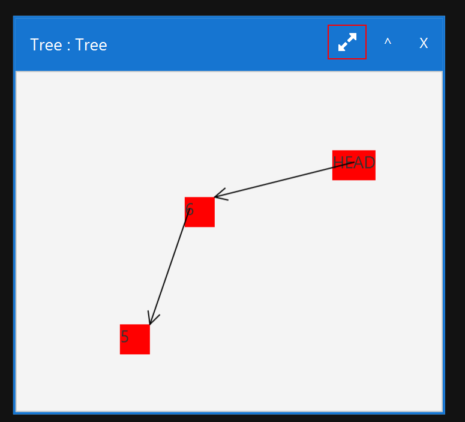

# BlueJ-Chicago Documents
##DEUTSCH
Um den Visualizer zu nutzen importiert man einfach die Jar als Bibliothek. Am beginn des Sourcecodes muss man noch osl2.Evanston.start(); ausführen. Von da aus kann man die Datenstrukturen VArray, VMap, VDoublyLinkedList, VSinglyLinkedList, VDirectedGraph, VUndirectedGraph und VTree nutzen.

###Datenstrukturen
**Für alle Datenstrukturen:**
- setName(String name):  Setzt den Namen der Datenstruktur
- getName()returns String:  Gibt den Namen der Datenstruktur zurück.
- getDatastructureType() return String:  Gibt den Typ der Datenstruktur zurück.
- size() returns int:  Gibt die Größe der Datenstruktur zurück.
- removeAll() returns boolean:  Entfernt alle Elemente aus der Datenstruktur. 
- isEmpty() returns boolean:  Gibt true zurück, falls die Datenstrucktur leer ist. Ansonsten flase.

**VArray<T>:**
- VArray<T>(int size):   Erstellt ein Array mit Größe size.
- VArray<T>(int size, String name):  Erstellt ein Array mit Größe size mit dem Namen name.
- setValue(int index, T value):  Sets an Index index den Wert value.
- getValue(int index) returns T:  Gibt den Wert an der Stelle des Indizes zurück.
- contains(T value)returns boolean:  Gibt true zurück, falls der Wert value im Array enthalten ist. Ansonsten false.
- contains(Collection<T> values) returns boolean:  Gibt true zurück, falls die Werte values im Array enthalten sind. Ansonsten false.

**VSinglyLinkedList<T> / VDoublyLinkedList<T>:**
- VSinglyLinkedList <T>():  Erstellt eine neue einfach verkettete Liste.
- VDoublyLinkedList <T>():  Erstellt eine neue doppelt verkettete Liste.
- VSinglyLinkedList <T>(String name):  Erstellt eine neue einfach verkettete Liste mit dem Namen name.
- VDoublyLinkedList <T>(String name):  Erstellt eine neue doppelt verkettete Liste mit dem Namen name.
- Für die restlichen Methoden siehe:  [java.util.List](https://docs.oracle.com/en/java/javase/11/docs/api/java.base/java/util/List.html)

**VMap<K, V>:**
- VMap<K, V>():  Erstellt eine neue VMap.
- VMap<K, V>(String name):  Erstellt eine neue VMap mit dem Namen name.
- Für die estlichen Methoden siehe:  [java.util.Map](https://docs.oracle.com/en/java/javase/11/docs/api/java.base/java/util/Map.html)

**VGraphNode<T>:**
- setValues(T value):  Setzt den Value des Knotens.

**VDirectedGraph<T> / VUndirectedGraph<T>:**
- VDirectedGraph<T>():  Erstellt einen neuen gerichteten Graphen.
- VUndirectedGraph<T>():  Erstellt einen neuen ungerichteten Graphen.
- VDirectedGraph<T>(String name):  Erstellt einen neuen gerichteten Graphen mit dem Namen name.
- VUndirectedGraph<T>(String name):  Erstellt einen neuen ungerichteten Graphen mit dem Namen name.
- addNode() returns VGraphNode<T>:  addNode erstellt einen Knoten im Graphen. Nur so erstellte Knoten können im Graphen benutzt werden.
- addNode(T value) returns VGraphNode<T>:  addNode erstellt einen Knoten im Graphen. Der Knoten bekommt den Wert value. Nur so erstellte Knoten können im Graphen benutzt werden.
- addEdge(VGraphNode<T>  start, VGraphNode<T> end) returns boolean:  Fügt eine Kante von start zu end hinzu. Gibt true bei Erfolg zurück ansonsten false.
- removeNode(VGraphNode<T>  node)returns boolean:  Entfernt einen Knoten aus dem Graphen. Gibt true bei Erfolg zurück ansonsten false.
- removeEdge(VGraphNode<T>  start, VGraphNode<T> end) returns boolean:  Entfernt eine Kante aus dem Graphen. Gibt true bei Erfolg zurück ansonsten false.
- getEdges(VGraphNode<T> node)returns Collection<VEdge>:  Gibt eine Collection an Kanten zu einem Knoten zurück.
- getAdjacents(VGraphNode<T> node)returns Collection<VGraphNode>:  Gibt alle benachbarten Knoten zu einem Knoten an.
- containsNode(VGraphNode<T> node) returns boolean:  Gibt true aus, falls der Knoten im Graphen ist, ansonsten false.
- containsEdge(VGraphNode<T> node, VGraphNode<T> node) returns boolean:  Gibt true aus, falls die Kante im Graphen ist, ansonsten false.

**VTree<T>:** (Nutzt auch VGraphNodes)
- VTree<T>():  Erstellt einen neuen Baum.
- VTree<T>(String name):  Erstellt einen neuen Baum mit dem Namen name.
- addTreeNode(VGraphNode<T> parent) returns VGraphNode<T>:  addNode erstellt einen Knoten im Tree. Dieser Knoten wird zu einem Parent im Tree hinzugefügt.
- addTreeNode(VGraphNode<T> parent, T value) returns VGraphNode<T>:  addNode erstellt einen Knoten im Tree. Dieser Knoten wird zu einem Parent im Tree hinzugefügt. Außerdem wird für ihn der Wert value gesetzt.
- removeLeaf(VGraphNode node)returns boolean:  Entfernt einen Knoten, falls er ein Blatt ist. Gibt true bei Erfolg zurück ansonsten false.
- getChildren(VGraphNode parent)returns collection<VGraphNode>:  Gibt alle Childknoten eines Parentknoten zurück.
- getParent(VGraphNode child)returns VGraphNode:  Gibt den Parentknoten eines Childknoten zurück.
- getHeight()returns int:  Gibt die Höhe des Baumes zurück. Also die Länge des längsten Pfades von Wurzel bis Blatt.
- swap(VGraphNode child, VGraphNode parent)returns boolean:  Tauscht Childknoten mit Parentknoten. Gibt true bei Erfolg zurück ansonsten false.
- contains(VGraphNode node)returns boolean:  Gibt true aus, wenn ein Knoten im Baum ist. Ansonsten false.
- contains(Collection<VGraphNode> node) returns boolean:  Gibt true aus, wenn die Menge an Knoten im Baum ist. Ansonsten galse.
- getRootNode()returns VGraphNode:  Gibt die Wurzel des Baumes zurück.

###GUI
**Mirror Nutzung** 
Der Mirror wird in der Seitenleiste durch das klicken auf den entsprechenden Button geöffnet.
Den Mirror kann man innerhalb des Hauptbereichs verschieben. Man kann ihn schließen, sowie maximieren und minimieren. Außerdem lässt sich die Größe des Mirrors verändern.

Für das Verändern der Größe klicke man auf den Button der im folgenden Bild Rot umrandet ist.

##ENGLISH
To use the visualizer import the jar as a library. At the start of your code u type osl2.Evanston.start();. Then you can use the Datastructures VArray, VMap, VDoublyLinkedList, VSinglyLinkedList, VDirectedGraph, VUndirectedGraph and VTree. 

###Datastructures
**For all Datastructures:**
- setName(String name):  Sets the name of the datastructure.
- getName()returns String:  Returns the name of the datastructure.
- getDatastructureType() return String:  Returns the type of the datastructure.
- size() returns int:  Returns the size of the datastructure.
- removeAll() returns boolean:  Removes all elements of the datastructure.
- isEmpty() returns boolean:  Returns true if the datastructure is empty. Else false.

**VArray<T>:**
- VArray<T>(int size):  Creates a new VArray with the size size.
- VArray<T>(int size, String name):  Creates a new VArray with the size size and the name name.
- setValue(int index, T value):  Sets the value at index index.
- getValue(int index) returns T:  Returns the value at the index.
- contains(T value)returns boolean:  Returns true if the value is in the array. Else false.
- contains(Collection<T> values) returns boolean:  Returns true if the collection of values is in the array. Else false.

**VSinglyLinkedList<T> / VDoublyLinkedList<T>:**
- VSinglyLinkedList <T>():  Creates a new singly linked list.
- VDoublyLinkedList <T>():  Creates a new doubly linked list.
- VSinglyLinkedList <T>(String name):  Creates a new singly linked list with the name name.
- VDoublyLinkedList <T>(String name): Creates a new doubly linked list with the name name.
- For all other methods look at:  [java.util.List](https://docs.oracle.com/en/java/javase/11/docs/api/java.base/java/util/List.html)

**VMap<K, V>:**
- VMap<K, V>():  Creates a new VMap.
- VMap<K, V>(String name):  Creates a new VMap with the name name.
- For all other methods look at:  [java.util.Map](https://docs.oracle.com/en/java/javase/11/docs/api/java.base/java/util/Map.html)

**VGraphNode<T>:**
- setValues(T value):  Sets the value of the node..

**VDirectedGraph<T> / VUndirectedGraph<T>:**
- VDirectedGraph<T>():  Creates a new directed graph.
- VUndirectedGraph<T>():  Creates a new undirected graph.
- VDirectedGraph<T>(String name):  Creates a new directed graph with the name name.
- VUndirectedGraph<T>(String name):  Creates a new undirected graph with the name name.
- addNode() returns VGraphNode<T>:  Creates a new node in the graph. Only nodes which are created by addNode can be used by the graph.
- addEdge(VGraphNode<T>  start, VGraphNode<T> end) returns boolean:  Adds an edge from start to end. Returns true if added sucsessfully, else false.
- removeNode(VGraphNode<T>  node)returns boolean:  Removes a node from the graph. Returns true if removed sucsessfully, else false.
- removeEdge(VGraphNode<T>  start, VGraphNode<T> end) returns boolean:  Removes an edge from the graph. Returns true if removed sucsessfully, else false.
- getEdges(VGraphNode<T> node)returns Collection<VEdge>:  Returns a collection of all Edges.
- getAdjacents(VGraphNode<T> node)returns Collection<VGraphNode>:  Returns a collection of all adjacent nodes.
- containsNode(VGraphNode<T> node) returns boolean:  Returns true if the node is in the graph, else false.
- containsEdge(VGraphNode<T> node, VGraphNode<T> node) returns boolean:  Returns true if the edge is in the graph else false

**VTree<T>:** (Nutzt auch VGraphNodes)
- VTree<T>():  Creates a new tree.
- VTree<T>(String name):  Creates a new tree with the name name.
- addTreeNode() returns VGraphNode<T>:  Creates a new node in the tree. Only nodes which are created by addNode can be used by the tree.
- addChild(VGraphNode<T>:  child, VGraphNode<T> parent) returns boolean:  Adds a child to a parentnode.
- removeLeaf(VGraphNode node)returns boolean:  Removes a node if it is a leaf. Returns true if removed sucsessfully, else false.
- getChildren(VGraphNode parent)returns collection<VGraphNode>:  Returns all children from one parent node.
- getParent(VGraphNode child)returns VGraphNode:  Returns the parent node from the child node.
- getHeight()returns int:  Returns the height of the tree. The height is the largest path from root to a leaf.
- swap(VGraphNode child, VGraphNode parent)returns boolean:  Swaps child and parent node.Returns true if swaped sucsessfully, else false.
- contains(VGraphNode node)returns boolean:  Returns true if a node is in the tree,else false.
- contains(Collection<VGraphNode> node) returns boolean:  Returns true if an edge is in the tree, else false.
- getRootNode()returns VGraphNode:  Returns the root of the tree.

###GUI
**Mirror Usage** 
You can open the mirror by clicking on the mirrorbutton in the sidebar of the visualiser.
The mirror can be moved inside the mainregion. It can also be closed and minimized or maximizes. Also you can change the size.

For changing the size you click on the button which is red framed in the following picture and drag it.

